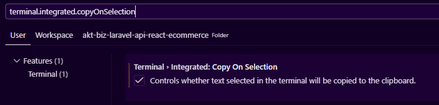

# AKT Technical Assessment | Nathaniel Gatpandan

## Overview

A **Laravel 12 REST API + React 19 Vite** monorepo e-commerce application. This project demonstrates best practices for building scalable API-first applications with token-based authentication, CRUD operations, and a responsive frontend.

## 📋 Table of Contents

- [Technology Stack](#technology-stack)
- [Project Structure](#project-structure)
- [Project Setup](#project-setup)
- [Architecture](#architecture)
- [API Endpoints](#api-endpoints)

## Technology Stack

### Backend [Grazulex/laravel-api-kit](https://github.com/Grazulex/laravel-api-kit)

| Technology               | Version | Purpose                      |
| ------------------------ | ------- | ---------------------------- |
| **Laravel**              | 12.0    | REST API Framework           |
| **PHP**                  | 8.3+    | Server Language              |
| **Laravel Sanctum**      | 4.0     | Token-based Authentication   |
| **Spatie Query Builder** | 6.0     | Advanced Filtering & Sorting |
| **Spatie Data**          | 4.0     | Type-safe Data Objects (DTO) |
| **Dedoc Scramble**       | 0.12    | Auto-generated OpenAPI Docs  |
| **Pest**                 | 4.0     | Testing Framework            |

### Frontend (React Vite + TypeScript)

| Technology               | Version | Purpose                 |
| ------------------------ | ------- | ----------------------- |
| **React**                | 19.2.0  | UI Framework            |
| **TypeScript**           | 5.9.3   | Type Safety             |
| **Vite**                 | 7.2.4   | Build Tool & Dev Server |
| **React Router**         | 7.13.0  | Client-side Routing     |
| **Tanstack React Table** | 8.21.3  | Data Grid & Tables      |
| **Zustand**              | 5.0.11  | State Management        |
| **Radix UI**             | 1.4.3   | Headless UI Components  |
| **Tailwind CSS**         | 4.1.18  | Utility-first Styling   |
| **React Hook Form**      | 7.71,1  | Form State Management   |
| **Axios**                | 1.13.4  | HTTP Client             |


## Project Setup

### Prerequisites

- **PHP 8.3+** + **Composer 2.x** + **Node 18+** + **npm/yarn**

### Docker Setup Backend

```bash
# Clone the repository
git clone https://github.com/LeinahI/akt-biz-laravel-api-react-ecommerce

# Go to backend directory
cd akt-biz-laravel-api-react-ecommerce/laravel-api-kit

# Copy environment file
cp .env.example .env

# Build and start containers
docker compose build && docker compose up -d

# Install dependencies
docker compose run --rm app composer install

# Generate application key
docker compose run --rm app php artisan key:generate

# Run migrations
docker compose run --rm app php artisan migrate

# (Optional) Seed sample data
# It also seed user account email: test@example.com | pass: password
docker compose run --rm app php artisan db:seed productseeder

# Run tests to verify installation
docker compose run --rm app ./vendor/bin/pest
```

### Local Setup Backend
```bash
# 1. Clone the repository
git clone https://github.com/LeinahI/akt-biz-laravel-api-react-ecommerce

# Go to backend directory
cd akt-biz-laravel-api-react-ecommerce/laravel-api-kit

# Copy environment file
cp .env.example .env

# Install PHP dependencies
composer install

# Generate application key
php artisan key:generate

# Run migrations
php artisan migrate

# (Optional) Seed sample data
# It also seed user account email: test@example.com | pass: password
php artisan db:seed productseeder

# Run unit test to verify if it's working
./vendor/bin/pest

# Run Laravel
php artisan serve
```

### Setup Frontend Locally (Create new Terminal first)
### Copy Text via Terminal easily (vscode settings)


```bash
cd react-vite

# Copy environment file
cp .env.example .env

# (optional) Change VITE_AUTH_SECRET or leave it to "mysecretkey"
# (still works if you leave it default)
# "ctrl+shift+c" to copy the key
node -e "console.log(require('crypto').randomBytes(64).toString('hex'))"

# Install Node dependencies
npm install

# Start development server
npm run dev
```

## Project Structure
<details>
<summary>Click to expand project structure</summary>

```
akt-biz-laravel-api-react-ecommerce/
├── laravel-api-kit/              # Backend API
│ ├── app/
│ │ ├── Http/
│ │ │ ├── Controllers/            # API Controllers
│ │ │ │ └── Api/V1/
│ │ │ │ ├── AuthController.php
│ │ │ │ └── Products/             # Products Controller for this Project
│ │ │ ├── Middleware/             # Custom Middleware
│ │ │ ├── Requests/               # Form Requests (Validation)
│ │ │ └── Resources/              # API Resources (Response Formatting)
│ │ ├── Models/                   # Eloquent Models
│ │ ├── Policies/                 # Authorization Policies
│ │ ├── Traits/                   # Reusable Traits
│ │ └── Providers/                # Service Providers
│ ├── routes/
│ │ ├── api.php                   # API Routes Entry
│ │ └── api/
│ │ └── v1.php                    # Version 1 Routes
│ ├── database/
│ │ ├── migrations/               # Schema Changes
│ │ ├── seeders/                  # Database Seeders
│ │ └── factories/                # Model Factories
│ ├── tests/
│ │ ├── Feature/                  # Feature Tests
│ │ └── Unit/                     # Unit Tests
│ ├── config/                     # Configuration Files
│ ├── .env.example                # Environment Template
│ ├── docker-compose.yml          # Docker Configuration
│ ├── Dockerfile                  # Docker Build
│ └── composer.json               # PHP Dependencies
│
├── react-vite/                   # Frontend Application
│ ├── src/
│ │ ├── components/               # React Components
│ │ ├── pages/                    # Page Components
│ │ ├── routes/                   # Route Configuration
│ │ ├── auth/                     # Auth Context & Logic
│ │ ├── hooks/                    # Custom Hooks
│ │ ├── store/                    # Zustand Stores
│ │ ├── types/                    # TypeScript Types
│ │ ├── lib/                      # Utilities
│ │ ├── assets/                   # Images, Icons
│ │ ├── main.tsx                  # Application Entry
│ │ └── index.css                 # Global Styles
│ ├── public/                     # Static Assets
│ ├── vite.config.ts              # Vite Configuration
│ ├── tsconfig.json               # TypeScript Configuration
│ └── package.json                # Node Dependencies
│
└── README.md                     # This file
```

</details>

## Architecture

API Architecture (Versioned REST API)

```
Request → Middleware (CORS, Auth, Rate Limiting)
    ↓
Route (v1.php)
    ↓
Controller (Api\V1\ProductsController)
    ↓
Model (Product)
    ↓
Policy (Authorize User)
    ↓
Resource (Format Response)
    ↓
JSON Response
```

<b>Key Features:</b>

- <b>Token-based Auth</b>: Laravel Sanctum tokens for mobile/SPA apps
- <b>API Versioning</b>: URI-based versioning (/api/v1/\*) with deprecation support
- <b>Rate Limiting</b>: 5 requests/min for auth routes, 120 requests/min for authenticated routes
- <b>Query Building</b>: Advanced filtering, sorting, and includes via spatie/laravel-query-builder
- <b>Auto Documentation</b>: Real-time OpenAPI 3.1 docs via Scramble
- <b>Response Standardization</b>: Consistent JSON response format via Traits

Frontend Architecture (React Single Page Application or SPA)

```
App Root (main.tsx)
    ↓
Router (React Router v7)
    ↓
Auth Context (Token Management)
    ↓
Route Components
    ↓
Pages (Products, Me)
    ↓
Components (Reusable UI)
    ↓
Zustand Stores (Global State)
    ↓
API Calls (Axios)
```

<b>Key Features:</b>

- <b>Token Storage:</b> Auth tokens stored in localStorage with context
- <b>Protected Routes:</b> Route guards for authenticated pages
- <b>API Client:</b> Axios instance with auto-attached auth headers
- <b>Form Handling:</b> React Hook Form for validation & submission
- <b>UI Components:</b> Radix UI primitives with Tailwind CSS
- <b>Type Safety:</b> Full TypeScript coverage

## API Endpoints

```
POST            api/v1/login ............................................... api.v1.login › Api\V1\AuthController@login
POST            api/v1/logout ............................................ api.v1.logout › Api\V1\AuthController@logout
GET|HEAD        api/v1/me ........................................................ api.v1.me › Api\V1\AuthController@me
GET|HEAD        api/v1/product-categories api.v1.product-categories › Api\V1\Products\ProductCategoriesController@index
GET|HEAD        api/v1/products ............................. products.index › Api\V1\Products\ProductsController@index
POST            api/v1/products ............................. products.store › Api\V1\Products\ProductsController@store
GET|HEAD        api/v1/products/{product} ..................... products.show › Api\V1\Products\ProductsController@show
PUT|PATCH       api/v1/products/{product} ................. products.update › Api\V1\Products\ProductsController@update
DELETE          api/v1/products/{product} ............... products.destroy › Api\V1\Products\ProductsController@destroy
POST            api/v1/register ...................................... api.v1.register › Api\V1\AuthController@register
GET|HEAD        docs/api ............................................................................. scramble.docs.ui  # API Documentation
GET|HEAD        docs/api.json .................................................................. scramble.docs.document
GET|HEAD        sanctum/csrf-cookie ............... ..sanctum.csrf-cookie › Laravel\Sanctum › CsrfCookieController@show
GET|HEAD        storage/{path} .......................................................................... storage.local
GET|HEAD        up ........................................................................ generated::tLi34kXPd5dRjTCQ
```

## Tips from someone who review this Repository

1. <b>Database Indexing in Migrations:</b> An index is a data structure the database maintains alongside your table that speeds up lookups on specific columns — like a book's index lets you jump to a topic instead of reading every page. Without an index, the database performs a full table scan (checks every row).

   ### Purpose

   | Benefit                       | Explanation                                                                               |
   | ----------------------------- | ----------------------------------------------------------------------------------------- |
   | **Faster Queries**            | `WHERE`, `ORDER BY`, `JOIN`, and `GROUP BY` on indexed columns are significantly faster   |
   | **Faster foreign key checks** | Referential integrity checks on inserts/updates/deletes become cheaper                    |
   | **Trade-off**                 | Indexes use extra disk space and slightly slow down `INSERT`/`UPDATE`/`DELETE` operations |

   **Rule of thumb:** Index columns you frequently filter, sort, or join on.

   ### Quick Reference

   | Method                    | SQL Equivalent       | Use When                       |
   | ------------------------- | -------------------- | ------------------------------ |
   | $table->index('col')      | INDEX (col)          | Frequent WHERE / ORDER BY      |
   | $table->index(['a', 'b']) | INDEX (a, b)         | Frequent WHERE a = ? AND b = ? |
   | $table->unique('col')     | UNIQUE INDEX (col)   | Column must have unique values |
   | $table->fullText('col')   | FULLTEXT INDEX (col) | Text search (LIKE '%term%')    |
   | $table->primary('col')    | PRIMARY KEY (col)    | Already done by ->id()         |

   **Key takeaway:** You add indexes in the migration, and your controller/Eloquent code stays exactly the same — the database optimizer automatically picks the best index for each query.
